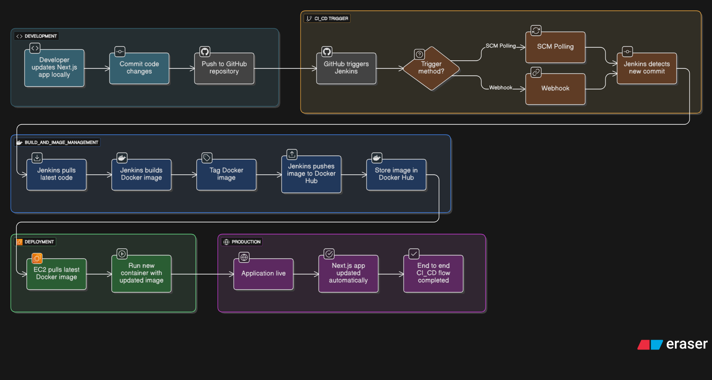

# Next.js CI/CD Pipeline with Jenkins, Docker & AWS EC2

## 📌 About This Project

This repository contains a **complete CI/CD setup** to deploy a **Next.js application** using:

-  **Next.js**
-  **Jenkins**
-  **Docker**
-  **Docker Hub**
-  **AWS EC2**
-  **Linux Server**

This CI/CD pipeline automates the entire workflow:

🧑‍💻 **Code → GitHub Push → Jenkins Build → Docker Push → EC2 Deployment**  
Everything runs on **ONE AWS EC2 instance** (Jenkins + Deployment) for learning and cost-saving.

---

## 🧩 CI/CD FLOW



---

## 📁 Repository Structure

```
repo/
├── app/                       → Next.js application code 🟦
├── public/                    → Static files  
├── vars/                      → Jenkins shared library functions 🤖
├── .dockerignore              → Docker ignore rules 🐳
├── .gitignore                 → Git ignore rules  
├── Dockerfile                 → Docker build instructions 🐳
├── Jenkinsfile                → Pipeline using shared library 🤖
├── Jenkinsfile.noshared       → Pipeline without shared library 🤖
├── README.md                  → Documentation  
├── next.config.ts             → Next.js config 🟦
├── tsconfig.json              → TypeScript config  
├── package.json               → Dependencies  
└── package-lock.json          → Lock file
```

---

## 🚀 What This CI/CD Pipeline Does

### ✅ Development
- Developer updates the code
- Commits & pushes to GitHub

### ✅ Jenkins Trigger
- GitHub Webhook notifies Jenkins
- Jenkins pulls the latest code  
  *( Webhook)*

### ✅ Build Stage
- Install dependencies
- Build Docker image
- Tag image properly (`username/image:tag`)
- Push image to Docker Hub

### ✅ Deployment (on EC2)
- EC2 pulls new Docker image
- Runs the updated container

### ✅ Production
- App updates automatically
- Zero manual deployment steps
- Fast & smooth CI/CD automation

---

## 📦 How to Use This Project (Step-by-Step)

### 1️⃣ Clone the GitHub Repository

```bash
git clone https://github.com/Sarvesh-Work/ci-cd-jenkins-next.js.git
cd ci-cd-jenkins-next.js
```

### 2️⃣ Set Up Jenkins on EC2

Install the following:
- Jenkins
- Docker
- Docker Compose (optional)

Then:
- Add `jenkins` user to the `docker` group
- Create these Jenkins credentials:
  - Docker Hub username/password
  - GitHub token (only required if repo is private)

### 3️⃣ Configure Jenkins Shared Library

Go to:  
**Manage Jenkins → System → Global Pipeline Libraries**

Add:
- **Name:** `shared`
- **Repository:** Your shared library GitHub repo
- **Load implicitly:** OFF

### 4️⃣ Configure GitHub Webhook

Go to:  
**GitHub → Repository → Settings → Webhooks → Add Webhook**

Use:
```
http://<your-ec2-public-ip>:8080/github-webhook/
```

Event:  
✔ Just the push event

### 5️⃣ Run the Pipeline

Jenkins will automatically:
1. Pull latest code
2. Build Docker image
3. Tag & push to Docker Hub
4. SSH into EC2
5. Pull latest image
6. Re-run the container

This provides a fully automated CI/CD pipeline 🚀

### 6️⃣ Access Your Application

Example:
```
http://<your-ec2-public-ip>:3000
```

---

## 🌟 Why I Built This

To understand real-world DevOps workflows:
- Practical CI/CD pipelines
- Jenkins + GitHub integration
- Docker image build/push
- EC2 container deployment
- Power of Jenkins Shared Libraries

This project gave me end-to-end hands-on DevOps experience.

---

## ⭐ Support

If this project helped you, please give the repo a star ⭐  
It motivates me to build more such projects!